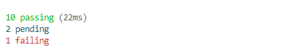
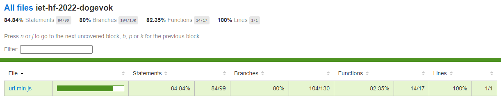
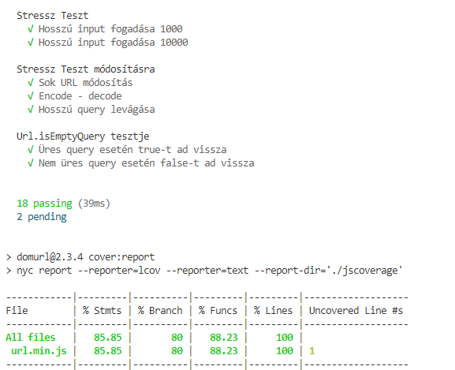
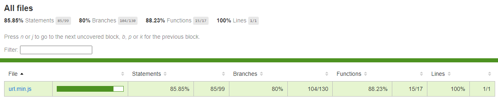

# Kód lefedettség és unit tesztek 

 A tesztek az _url.min.js_ fájlt tesztelik és a kód lefedettségének mérése is ezen a fájlon történt. 
 
 A tesztek futtatásához az eredetileg a projektben található mocha-t használtam, a kód lefedettségéhez pedig az istanbul package-t telepítettem. A _package.json_ fájlban létrehoztam újabb script parancsokat annak érdekében, hogy egyszerűen futtathatóak legyenek a tesztek, a code coverage eredményének konzolos megjelenítése valamint annak html-be generálása.

 ## Script parancsok
 - `npm run test:coverage`: tesztek futtatása és kód lefedettség megjelenítése konzolon 
 - `npm run test:coveragehtml`: tesztek futtatása és kód lefedettségéről html generálása
 - `npm run cover:unit`: tesztek futtatása
 - `npm run cover:report`: kód lefedettségének megjelenítése konzolon
 - `npm run cover:reporthtml`: kód lefedettségéről html generálása
 
## Eredeti kód lefedettség

 Először az eredetileg meglévő teszteket futtatuk, ezek közül egy sikertelenül futott le.

## Új kód lefedettség

Az eredeti tesztek közötti hibás teszt javításra került. Ebben egy const változónak próbáltak új értéket adni.

További három új unit tesztet írtunk, amelyek a fentebb található képen láthatóak.

## Új unit tesztek:
- Stressz teszt hosszú inputra
- Stressz teszt módosításra
- Url.isEmptyQuery tesztelése

Stressz teszteket Turai Botond, Url.isEmptyQuery tesztet Castillo-Hoós Marcell készítette. Kód lefedettséget Castillo-Hoós Marcell segítségével Hell Csaba végezte.

A kód megfelelő dokumentálásának hiányában sok időbe telt megérteni a kódot, így a tesztek megírása is sok időt vett igénybe.