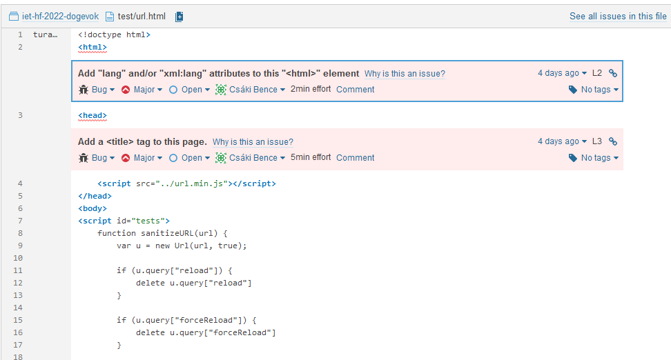
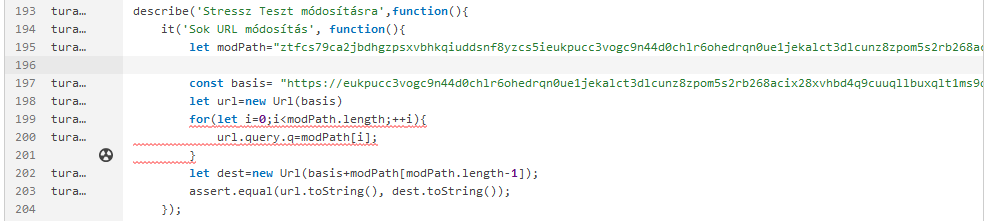
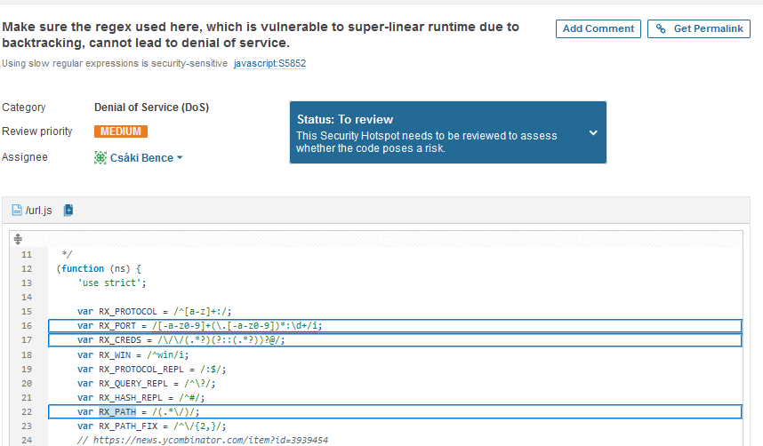

- ### Pár html konvenció alkalmazása, html lang és title beillesztés
  

- ### A stressztesztben egy szebb formára hozása a ciklusnak.
 

- ### Security issuenak az alábbiakat jelezte
 

Ezek regexből származó potenciális DoS támadási források. Mivel ez frontend alapú megoldás, a "potenciális" támadó igazából a felhasználó, aki csak szándékosan lenne képes ezt kihasználni, ezzel pedig saját gépét tudná terhelni, itt nincs szó szerver túlterhelésről.

