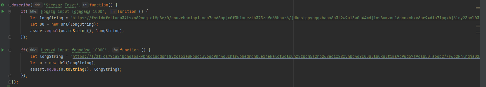

# Stressz teszt #
Megpróbáltam a tesztek során szélsőséges bemeneteken ellenőrizni, hogy az osztály az elvárt működést hozza-e.

Az alábbi teszteseteket vizsgáltam:
- Szélsőségesen hozzú URL-ek
- Szélsőségesen sok URL módosítás 
- URL encode - decode nagyon hosszú URL-en
- URL query paraméter levásgása nagyon hosszú címről

### Első próbálkozás ###
A tesztek megírásakor előszört random inputon szerettem volna a tesztelést elvégezni. Ez sajnos
hosszútávon nem volt jó megolás ugyanis a Sonar hibát jelzett. A hiba forrása az volt, hogy a 
Math osztály random függvénye csupán peszeudo random, és nem így nem biztonságos.

### Javítás ### 
Végül úgy döntöttem a tesztek bemenetei fix karakterláncok lesznek. Generáltam kellően hosszú
stringeket, és a teszteket kijavítottam. 

Feladaton dolgoztak: Csáki Bence és Turai Botond

