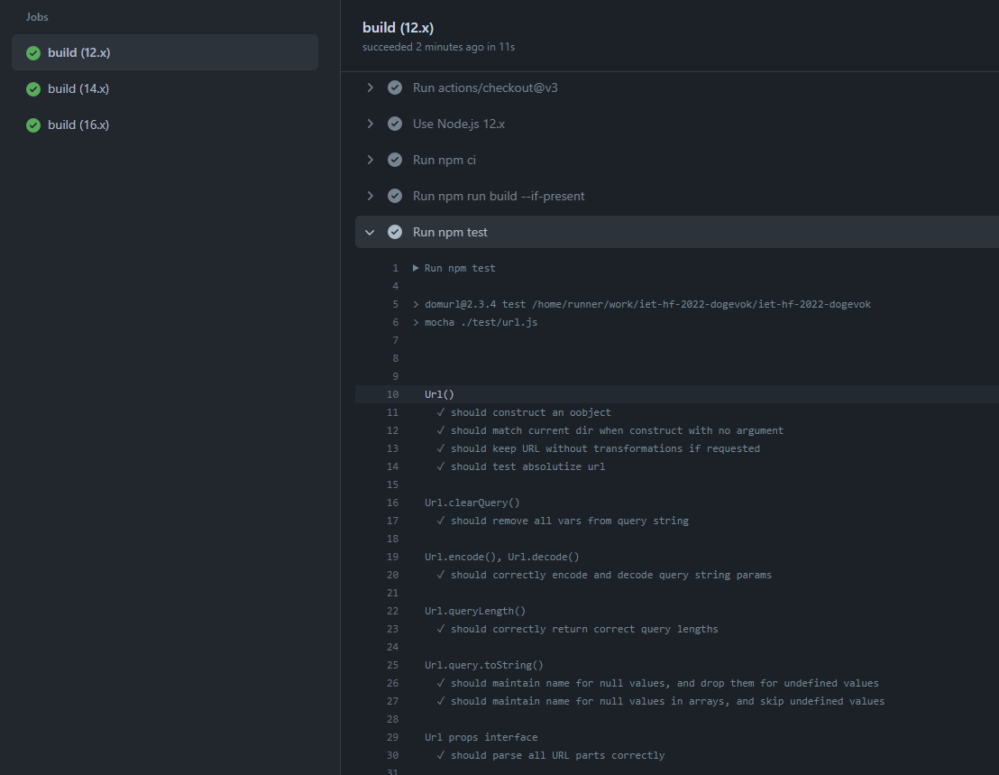

# Node.JS Action Workflow # 
Csaknem az eslő dolog volt amit megcsináltunk. Elsőre nem működött, mert nem létezett a package.json fájl, 
viszont miután futtattunk npm install-t illetve a gitignore-ban beállítottuk, hogy a node_moduls mappa ne vegyen részt
a verziókezelésben már helyesen működött a github Action. 

Ezt a feladatrészt Castillo-Hoós Marcell és Turai Botond csinálta. 

